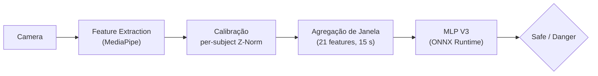

# DeteccaoFadiga

Sistema de detecção de fadiga em tempo real baseado em visão computacional e
aprendizado de máquina. Analisa o rosto do motorista/operador via câmera,
extrai indicadores oculares e de postura, e classifica o estado como
**Safe** ou **Danger** usando uma rede MLP executada em ONNX Runtime.

Projetado para rodar em **Raspberry Pi** (com AI Camera IMX500) ou em
**PC/notebook** com webcam USB.

## Arquitetura



| Etapa | Arquivo | Descrição |
|-------|---------|-----------|
| Extração de features | `feature_extractor_rt.py` | MediaPipe Face Landmarker → EAR, MAR, head pose (pitch/yaw/roll) |
| Calibração | `subject_calibrator_rt.py` | Warm-up de 120 s, seleciona melhor segmento de 30 s (maior EAR médio), calcula baseline Z-Norm por sujeito |
| Janela de features | `window_factory_rt.py` | Janela deslizante de 15 s → 21 features agregadas (estatísticas de EAR, MAR, pose, PERCLOS, blinks, microsleeps) |
| Inferência | `model_loader.py` | MLP V3 (21 → 128 → 64 → 2, skip connection), SelectiveScalerV2, threshold 0.51 |
| Loop principal | `run_realtime_demo.py` | Captura → extração → calibração → janela → inferência → display/overlay |
| Validação offline | `offline_eval.py` | Avaliação em lote sobre DataFrames (dev-only, requer PyTorch) |

## Estrutura do projeto

```
DeteccaoFadiga/
├── SALTE_INFERENCE/
│   ├── __init__.py
│   ├── feature_extractor_rt.py
│   ├── subject_calibrator_rt.py
│   ├── window_factory_rt.py
│   ├── model_loader.py
│   ├── run_realtime_demo.py
│   └── offline_eval.py
├── MODELS/
│   ├── mlp_v3.onnx
│   ├── mlp_v3_artifacts.json
│   └── tev7_summary.json
├── requirements.txt
└── README.md
```

## Requisitos

- **Python** 3.10+
- Dependências principais (ver `requirements.txt`):

| Pacote | Versão mínima |
|--------|---------------|
| numpy | 1.24 |
| opencv-python-headless | 4.8 |
| mediapipe | 0.10 |
| onnxruntime | 1.16 |
| scikit-learn | 1.3 |

Opcionais:

- **picamera2** — necessário apenas no Raspberry Pi com AI Camera IMX500.
- **PyTorch** — necessário apenas para `offline_eval.py` ou modelos `.pth`.

## Instalação

```bash
git clone https://github.com/euBrunoMelo/DeteccaoFadiga.git
cd DeteccaoFadiga
pip install -r requirements.txt
```

## Como usar

### Webcam USB (PC / notebook)

```bash
python -m SALTE_INFERENCE.run_realtime_demo \
    --model MODELS/mlp_v3.onnx \
    --scaler MODELS/scaler_v7.pkl \
    --artifacts MODELS/mlp_v3_artifacts.json
```

### Raspberry Pi + AI Camera IMX500

```bash
python -m SALTE_INFERENCE.run_realtime_demo \
    --picamera --headless \
    --model MODELS/mlp_v3.onnx \
    --scaler MODELS/scaler_v7.pkl
```

### Parâmetros CLI

| Parâmetro | Padrão | Descrição |
|-----------|--------|-----------|
| `--model` | `models/mlp_v3.onnx` | Caminho do modelo (`.onnx` ou `.pth`) |
| `--scaler` | `models/scaler_v7.pkl` | Caminho do scaler (pickle) |
| `--artifacts` | `models/mlp_v3_artifacts.json` | Artefatos do modelo (threshold, feature names) |
| `--threshold` | lido do artifacts | Sobrescreve o limiar de decisão |
| `--picamera` | off | Usa picamera2 (CSI / IMX500) |
| `--camera-index` | 0 | Índice da webcam USB |
| `--headless` | off | Sem janela de vídeo (para SSH sem X11) |
| `--warmup` | 120 s | Duração do warm-up para calibração |
| `--min-warmup` | 30 s | Tempo mínimo antes de permitir calibração forçada |
| `--fps` | 30 | FPS alvo |
| `--debug` | off | Imprime o vetor de 21 features a cada janela |

### Atalhos durante execução

- **c** — forçar calibração antes do fim do warm-up
- **q** — encerrar

## Modelo e métricas

**MLP V3** — rede com skip connection, treinada com 21 features extraídas de
vídeos faciais (experimento TEV7, 2026-02-18, validação cruzada em 4 folds).

| Métrica | Valor |
|---------|-------|
| Balanced Accuracy | 67.3 % |
| F1 (Danger) | 74.1 % |
| AUC-ROC | 71.6 % |
| Safe Recall | 65.4 % |
| Danger Recall | 69.2 % |

### Features utilizadas (21)

`ear_mean`, `ear_std`, `ear_min`, `ear_vel_mean`, `ear_vel_std`,
`mar_mean`, `pitch_mean`, `pitch_std`, `yaw_std`, `roll_std`,
`blink_count`, `blink_rate_per_min`, `blink_mean_dur_ms`,
`perclos_p80_mean`, `perclos_p80_max`, `blink_closing_vel_mean`,
`blink_opening_vel_mean`, `long_blink_pct`, `blink_regularity`,
`microsleep_count`, `microsleep_total_ms`

## Constraints de design

| ID | Regra |
|----|-------|
| C5 | Z-Norm sempre per-subject (nunca global) |
| C6-V2 | Calibração pelo segmento de 30 s com maior EAR médio nos primeiros 120 s |
| C13 | PERCLOS calculado sobre EAR cru (nunca Z-normalizado) |
| C21 | Velocidades expressas em EAR/s |
| C22 | Blink velocity limitada ao intervalo \[0.01, 5\] |

## Licença

A definir.
